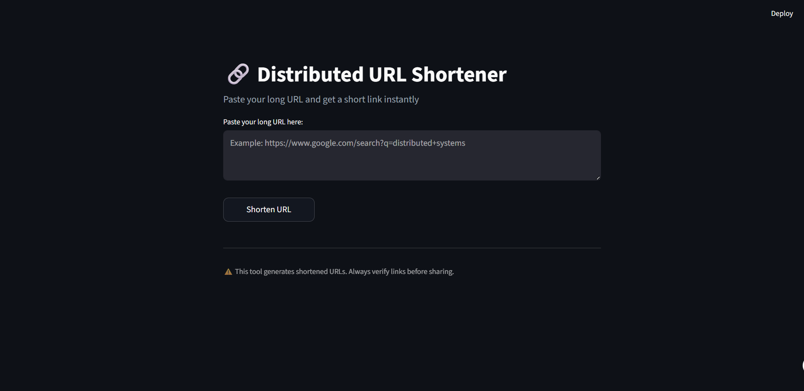
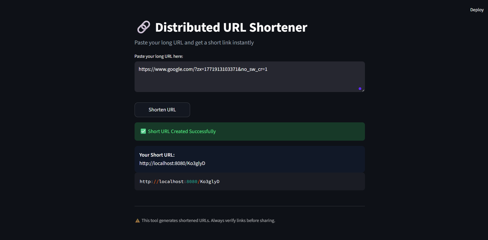

<div align="center">

# ⚡ Distributed URL Shortener

**A production-grade, horizontally scalable URL shortening service built in Go.**

[](https://golang.org/)
[](https://redis.io/)
[](https://www.docker.com/)
[](https://prometheus.io/)
[](LICENSE)

[Overview](#-overview) · [Architecture](#-architecture) · [Features](#-features) · [Quick Start](#-quick-start) · [API Reference](#-api-reference) · [Configuration](#-configuration) · [Deployment](#-cloud-deployment) · [Roadmap](#-roadmap)

</div>

---

## 🧭 Overview

**Distributed URL Shortener** is a backend system engineered with real-world distributed systems principles in mind. Built entirely in Go, it is designed to handle high concurrency, horizontal scaling, and production-level reliability — not just as a toy project, but as a blueprint for how scalable systems are architected, containerized, and deployed.

The service converts long URLs into compact short codes, resolves them with sub-millisecond latency via an LRU cache, and enforces fair usage through a Redis-backed distributed rate limiter — all wrapped in a clean, layered architecture.

---

## 🏗 Architecture

```
┌────────────────────────────────────┐
│     Client (Streamlit UI / API)    │
└──────────────┬─────────────────────┘
               │ HTTP
┌──────────────▼─────────────────────┐
│       Go HTTP API  (Stateless)     │
│  POST /shorten  ·  GET /{code}     │
│  GET /health   ·  GET /metrics     │
└──────────────┬─────────────────────┘
               │
┌──────────────▼─────────────────────┐
│          Service Layer             │
│   Business Logic · Rate Limiting   │
└────────┬──────────────┬────────────┘
         │              │
┌────────▼──────┐  ┌────▼───────────┐
│  LRU Cache    │  │  Redis Store   │
│  (In-Memory)  │  │  (Persistent)  │
└───────────────┘  └────────────────┘
```

### Design Principles

- **Stateless compute layer** — any instance can serve any request; ideal for load balancing
- **Separation of concerns** — handler → service → cache → store, each with a single responsibility
- **Distributed rate limiting** — Redis sliding window counters shared across all instances
- **Cache-aside strategy** — hot URLs served from in-memory LRU cache; Redis is the source of truth
- **Cloud-native configuration** — all tunables are environment-driven, no hardcoded values

---

## ✨ Features

| Feature | Description |
|---|---|
| 🔗 **URL Shortening** | Converts long URLs into short, collision-resistant codes |
| ⚡ **LRU Cache** | In-memory cache for hot paths — reduces Redis round-trips |
| 🛡 **Rate Limiting** | Redis-backed sliding window — distributed and abuse-resistant |
| 📦 **Redis Persistence** | Durable URL mappings survive restarts |
| 🐳 **Docker Ready** | Multi-stage build with distroless runtime image |
| 📊 **Prometheus Metrics** | Expose `/metrics` for observability and alerting |
| ❤️ **Health Check** | `/health` endpoint for load balancer / orchestrator probes |
| 🎨 **Streamlit UI** | Lightweight Python frontend for manual testing and demos |
| ☁️ **Cloud Deployable** | Stateless design enables deployment to any cloud platform |

---

## 🛠 Tech Stack

| Layer | Technology |
|---|---|
| Language | Go (Golang) |
| Persistence | Redis 7 |
| Caching | In-memory LRU Cache |
| Rate Limiting | Redis sliding window |
| Containerization | Docker (multi-stage, distroless) |
| Orchestration | Docker Compose |
| Frontend | Streamlit (Python) |
| Observability | Prometheus |

---

## 📸 Preview

| Home | Shortened URL |
|---|---|
|  |  |

---

## 🚀 Quick Start

### Prerequisites

- [Docker](https://www.docker.com/) & [Docker Compose](https://docs.docker.com/compose/) — for containerized setup
- [Go 1.21+](https://golang.org/dl/) — for local development
- [Python 3.9+](https://www.python.org/) & [Streamlit](https://streamlit.io/) — for the frontend UI

---

### ▶ Option 1 — Docker Compose (Recommended)

The fastest way to get everything running. Starts both Redis and the API automatically.

```bash
# Clone the repository
git clone https://github.com/SATYAM-2013/distributed-url-shortener.git
cd distributed-url-shortener

# Build and start all services
docker compose up --build
```

The API will be live at:

```
http://localhost:8080
```

---

### ▶ Option 2 — Manual Setup (Local Development)

**Step 1 — Start Redis**

```bash
docker run -d -p 6379:6379 redis:7
```

**Step 2 — Run the backend**

```bash
go run cmd/api/main.go
```

The API starts on `http://localhost:8080`.

**Step 3 — Run the frontend (optional)**

```bash
pip install streamlit requests
streamlit run app.py
```

The Streamlit UI will open at `http://localhost:8501`.

---

## 📡 API Reference

### `POST /shorten`

Create a short URL from a long URL.

**Request**

```http
POST /shorten
Content-Type: application/json

{
  "url": "https://www.example.com/some/very/long/path?with=params"
}
```

**Response**

```json
{
  "short_url": "http://localhost:8080/abc123"
}
```

---

### `GET /{code}`

Resolve a short code and redirect to the original URL.

```http
GET /abc123
→ 301 Redirect → https://www.example.com/some/very/long/path?with=params
```

---

### `GET /health`

Returns the health status of the service. Suitable for load balancer probes.

```http
GET /health
→ 200 OK
```

```json
{
  "status": "ok"
}
```

---

### `GET /metrics`

Exposes Prometheus-compatible metrics for observability pipelines.

```http
GET /metrics
→ 200 OK  (text/plain; Prometheus exposition format)
```

---

### `GET /api`

Returns service metadata and version information.

```http
GET /api
→ 200 OK
```

---

## ⚙ Configuration

All configuration is environment-driven. No config files needed — set these vars before running.

| Variable | Description | Default |
|---|---|---|
| `PORT` | HTTP server port | `8080` |
| `REDIS_ADDR` | Redis connection string | `127.0.0.1:6379` |
| `CACHE_SIZE` | Maximum LRU cache entries | `100000` |

**Example — custom configuration**

```bash
PORT=9090 REDIS_ADDR=my-redis:6379 CACHE_SIZE=50000 go run cmd/api/main.go
```

**In Docker Compose**, set these under the `environment` key in `docker-compose.yml`.

---

## 🔒 Rate Limiting

The service uses a **Redis-backed sliding window rate limiter**:

- Enforced per API key / IP address
- State is stored in Redis — limits are shared across all instances
- Requests exceeding the limit receive `429 Too Many Requests`
- Fully distributed — safe for multi-instance deployments

---

## ☁ Cloud Deployment

The service is stateless and fully containerized — deploy it anywhere.

| Platform | Notes |
|---|---|
| **Render** | Push the repo; auto-detects Dockerfile |
| **Fly.io** | `fly launch` from the project root |
| **AWS ECS / EC2** | Use the Docker image with an ALB in front |
| **Google Cloud Run** | Stateless container — ideal fit |
| **Azure Container Apps** | Environment variable injection supported |
| **Kubernetes** | Stateless pods + Redis as a `StatefulSet` or managed service |

**Key properties enabling cloud deployment:**
- Stateless instances — scale horizontally without coordination
- Environment-based configuration — no secrets baked into images
- Distroless runtime — minimal attack surface and image size
- No local disk dependency — all state lives in Redis

---

## 📁 Project Structure

```
distributed-url-shortener/
├── cmd/
│   └── api/
│       └── main.go          # Application entry point
├── internal/
│   ├── handler/             # HTTP handlers
│   ├── service/             # Business logic & rate limiting
│   ├── cache/               # LRU cache implementation
│   └── store/               # Redis persistence layer
├── screenshots/             # Application preview images
├── app.py                   # Streamlit frontend
├── Dockerfile               # Multi-stage, distroless build
├── docker-compose.yml       # Local orchestration
├── go.mod
└── go.sum
```

---

## 🧠 Engineering Highlights

This project showcases practical knowledge of:

- **Distributed systems design** — stateless services, shared state via Redis
- **Caching strategies** — cache-aside with LRU eviction for hot-path optimization
- **Rate limiting algorithms** — sliding window counters in a distributed context
- **Docker best practices** — multi-stage builds, distroless images, bridge networking
- **Clean architecture** — layered design with clear separation of concerns
- **Observability** — metrics exposure for real-world production monitoring

---

## 🗺 Roadmap

- [ ] Custom short codes / vanity URLs
- [ ] URL expiration (TTL support)
- [ ] Click analytics dashboard
- [ ] JWT-based authentication
- [ ] Kubernetes Helm chart
- [ ] GitHub Actions CI/CD pipeline
- [ ] Load testing benchmarks (k6 / wrk)
- [ ] Multi-region Redis replication

---

## 📄 License

This project is licensed under the [MIT License](LICENSE).

---

<div align="center">

Designed and developed with engineering discipline by **[Satyam Sinha](https://github.com/SATYAM-2013)**

If you found this useful, give it a ⭐ — it helps!

</div>
